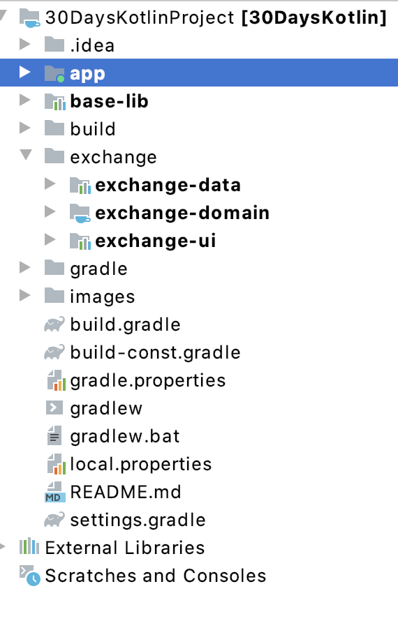

# 30 Days Of Kotlin 

## Android-Kotlin-Fundamentals
This repository contains Android Studio project created using concepts learned from 30 days Kotlin Challenge Codelabs.This is my final code submitted by me for Kotlin Challenge.

## This project is created and submitted under the underlines of Challenge
1. Used Kotlin as primary language of the app.
2. Implemented at least 3 Kotlin concepts that was learned recently. 
3. Used Android Studio to build an Android app using Kotlin.

You can view the full details of this program here -: [30 Days of Kotlin with Google Developers](https://eventsonair.withgoogle.com/events/kotlin)

## Highlight For Repository
This Repository contains a CurrencyActivity that contains CurrencyFragment which take Input Currency and Amount and converts it to selected Currency Amount. . 

## Currency Activity ScreenShot

## Project Structure

## Kotlin Concepts Used
1. Null Safety Concept
2. Kotlin Lambda's
3. Coroutines
4. Functions
5. lateinit
6. Kotlin Datatypes
7. Data Class
8. Smart Casting of variables

## Android Components Used
1. Data Binding
2. LiveData
3. Navigation
4. ViewModel
5. ViewModelFactory
6. RecyclerView
7. Room

## 3rd Party Integration's
1. Retrofit
2. Gson
3. Dagger2
4. rxjava2

## Testing Project
In order to test this **Android Studio** project follow below steps:
1. Run the App
2. Main Currency screen will be launched which will contain Two Editext Boxes and currency dropdowns.
3. Enter amount in the first Edittext and select the currency for the entered amount.
4. Select the Currency from the dropdown in which you want to convert the entered amount. 
5. Output will be displayed in the Second Edittext.

## Language Used => Kotlin
Kotlin is a **cross-platform**, **statically typed**, **general-purpose** programming language with type inference. Kotlin is designed to interoperate fully with Java, and the JVM version of its standard library depends on the Java Class Library, but type inference allows its syntax to be more concise.

Android mobile development has been **Kotlin-first** since **Google I/O in 2019**.

For More information about **Kotlin** and It's benefit with **Android Development** can be found [Here](https://kotlinlang.org/docs/reference/android-overview.html)

In this project **Kotlin Plugin** Version is:**1.3.50**

## Android Studio
Android Studio is the official integrated development environment for Google's Android operating system, built on JetBrains' IntelliJ IDEA software and designed specifically for Android development. It is available for download on Windows, macOS and Linux based operating systems. 

In this project **Android Studio** Version is: ***4.0.0**

## Gradle
Gradle is an open-source build automation system that builds upon the concepts of Apache Ant and Apache Maven and introduces a Groovy-based domain-specific language instead of the XML form used by Maven for declaring the project configuration

In this project **Gradle Plugin** Version is: **3.5.1**

